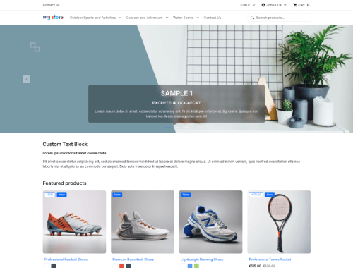
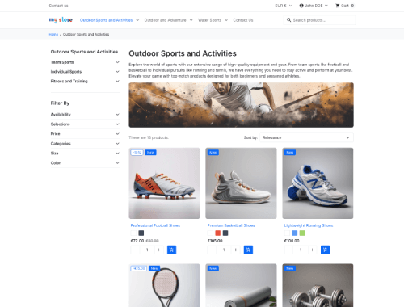
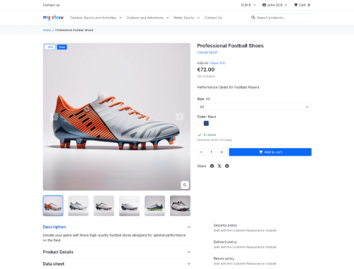

# Hummingbird Theme for PrestaShop


Hummingbird is a modern, in-development theme for PrestaShop built to be
compatible with versions `9.1.x` and above.

## ✅ Compatibility

| Hummingbird | PrestaShop | Status |
| ----------- | ---------- | ------ |
| `develop`   | `~10.0.0`  | Next major |
| `2.x`       | `~9.1.1`   | Maintained |
| `2.0.0`     | `~9.1.0`   | Released |

> [!NOTE]
> Version ranges follow [semver](https://semver.org) notation: `~X.Y.Z` = any patch
> within `X.Y`, `^X.Y.Z` = any minor/patch within `X`. This mirrors the `to` field
> in [`config/theme.yml`](config/theme.yml).

## 🔍 Theme Previews

| [](docs/homepage.png) | [](docs/category.png) | [](docs/product.png) |
| -------------------------------------------------------- | -------------------------------------------------------- | ------------------------------------------------------ |
| Homepage                                                 | Category                                                 | Product                                                |

## ⚠️ Requirements

To work on Hummingbird, you'll need:

- Node.js **v20.x**.
- npm **v8**.

## 📑 Table of Contents

- Want to help develop the theme? Start with
  [🔨 Develop on Hummingbird](#-develop-on-hummingbird).
- Using an AI assistant (Cursor, Copilot...)? Check
  [🤖 AI-Assisted Development](#-ai-assisted-development).
- Want to preview or test it? Jump to
  [🐳 Run Hummingbird with Docker](#-run-hummingbird-with-docker).
- Having issues with caching during development? Jump to
  [🥵 Troubleshooting](#-troubleshooting).

## 🔨 Develop on Hummingbird

### 🧰 Installation / Setup

#### 👀 Watch Mode Setup

From the **project root** run the following commands if you want to:

1. Install dependencies: `npm ci`.
2. Run watch mode to build assets: `npm run watch`.
3. You can now go to
   [🐳 Run Hummingbird with Docker](#-run-hummingbird-with-docker) section to
   run PrestaShop embedding Hummingbird.

#### 🔥 Hot Module Reload (HMR) Setup

1. From the **project root** run: `npm ci`.
2. Navigate to the `webpack/` directory.
3. Run `cp .env-docker-example .env` or `cp .env-vhost-example .env` (depending
   on how you want to run your PrestaShop environment).
4. Edit `.env` with your local environment settings and ensure you use a free
   TCP port.
5. From the **project root** run `npm run dev`.
6. You can now go to
   [🐳 Run Hummingbird with Docker](#-run-hummingbird-with-docker) section to
   run PrestaShop embedding Hummingbird.

### 🖌️ Code Quality

To ensure code quality and consistency, run the following commands from the
**project root**:

- Lint & auto-fix SCSS files: `npm run stylelint` or `npm run stylelint:fix`.
- Format & auto-format SCSS with Prettier: `npm run prettier` or
  `npm run prettier:fix`.
- Lint & auto-fix JS/TS files: `npm run lint` or `npm run lint:fix`.

## 🤖 AI-Assisted Development

Hummingbird V2 is natively optimized for AI-assisted development (vibe coding).
We have set up a strict System Context to prevent AI models from hallucinating
legacy PrestaShop patterns (like using jQuery or mixing CSS classes with JS
logic) and to enforce our modern `data-ps-*` declarative framework.

**How to use AI with this repository:**

- **⚡ Zero-Config IDEs (Cursor, Windsurf, Antigravity, GitHub Copilot):** If
  you use a modern AI-powered editor or CLI (like Claude Code), you have
  **nothing to configure**. The repository includes pointer files
  (`.cursorrules`, `.antigravityrules`, etc.) that automatically inject the
  project's architectural rules into your agent's context. Just open the project
  and start prompting!
- **🌐 Web-based Assistants (ChatGPT, Claude.ai, Gemini):** If you use a web
  interface, please open the [`CONTEXT.md`](CONTEXT.md) file at the root of this
  project and copy-paste its content into your initial prompt (or set it as your
  "System Prompt" for the session).

> [!WARNING]\
> **Contributor Disclaimer:** AI is a powerful co-pilot, but _you_ remain the
> pilot. Always review the generated code to ensure it strictly follows our
> accessibility (WAI-ARIA) guidelines and does not introduce legacy code.

## 🐳 Run Hummingbird with Docker

This theme includes Docker configurations for both **PrestaShop** and
**PrestaShop Flashlight** development environments.

### 🛠️ Getting Started

**Note:** If you've already set up your development environment using
`Watch Mode` or `Hot Module Reload (HMR)`, you can skip ahead to **step 3**.

1. From the **project root** run: `npm ci`.
2. Then run: `npm run build`.
3. Navigate to the `docker/` directory: `cd docker`.
4. Copy the example environment file: `cp .env-example .env`.
5. Edit `.env` to configure the following variables:
   - `PS_TAG`: PrestaShop or Flashlight version tag.
     - [PrestaShop tags](https://hub.docker.com/r/prestashop/prestashop/tags).
     - [Flashlight tags](https://hub.docker.com/r/prestashop/prestashop-flashlight/tags).
   - `PLATFORM`: Platform architecture (e.g., linux/amd64, linux/arm64).
   - `ADMIN_EMAIL`: Back office admin email.
   - `ADMIN_PASSWORD`: Back office admin password.

### 📦 Available Configurations

- `docker-compose-prestashop.yml`: for standard PrestaShop development
  environment.
- `docker-compose-flashlight.yml`: for PrestaShop Flashlight development
  environment.

### ▶️ Starting the Environment

From the **project root**, run one of the following commands:

```bash
# For PrestaShop environment
docker compose -f docker/docker-compose-prestashop.yml up -d

# For Flashlight environment
docker compose -f docker/docker-compose-flashlight.yml up -d
```

### 👀 After Starting the Environment

- PrestaShop/Flashlight will be available at http://localhost:8887 and BO at
  http://localhost:8887/admin-dev.
- phpMyAdmin will be available at http://localhost:8889.

### ⏹️ Stopping the Environment

From the **project root**, run one of the following commands:

```bash
# For PrestaShop environment
docker compose -f docker/docker-compose-prestashop.yml down -v

# For Flashlight environment
docker compose -f docker/docker-compose-flashlight.yml down
```

## 🥵 Troubleshooting

> [!WARNING]\
> If you're experiencing issues with styles or assets not updating while using
> HMR mode, follow these steps to avoid browser and PrestaShop caching problems:

1. Disable browser cache during development:
   - Open your browser's DevTools.
   - Go to the `Network` tab.
   - Enable `Disable cache` (⚠️ this only works while DevTools stays open).
2. Disable PrestaShop caching:
   - In the back office, go to: `Advanced Parameters` → `Performance`.
   - Under the Smarty section:
     - Set Force compilation to `Yes`.
     - Set Cache to `No`.
   - Under the CCC (Combine, Compress and Cache) section:
     - Disable all options.

## 📚 Storybook

Storybook is used to document and preview the theme's UI components during
development. You can view the
[live documentation here](https://build.prestashop.com/hummingbird/). Since the
theme is still in progress, contributions to improve or expand the documentation
are welcome and encouraged.

### ▶️ Run Storybook Locally

To run Storybook on your machine:

1. Make sure project dependencies are installed, if not, from the **project
   root** run: `npm ci`.
2. Then run: `npm run storybook`.
3. Storybook will be available at http://localhost:6006.

## 🤝 Contributing

Please refer to the [contributing guide](CONTRIBUTING.md).

## ✅ Continuous Integration

The CI runs include Stylelint, Prettier, ESLint, and TypeScript type checks.

## 🚀 Continuous Deployment

Whenever the `develop` branch is merged into `master`, the Storybook
documentation is automatically deployed to GitHub Pages and becomes publicly
accessible within minutes.

## 📄 License

This theme is released under the [Academic Free License 3.0][AFL-3.0].

[AFL-3.0]: https://opensource.org/licenses/AFL-3.0
